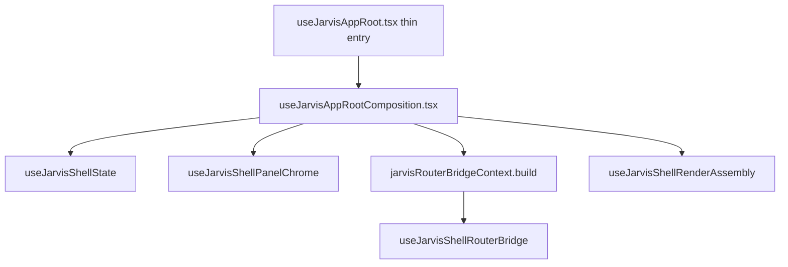
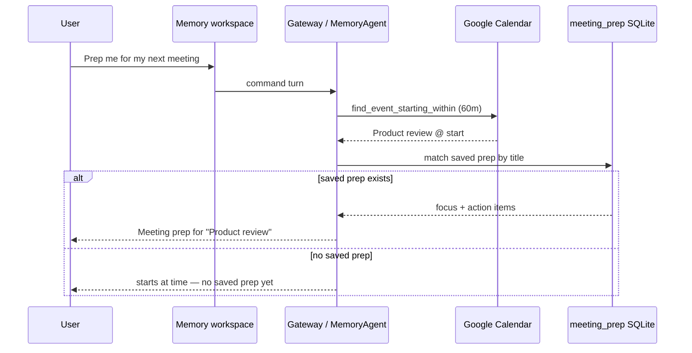

# Wave 12 architecture — Peel closeout + meeting copilot depth

Wave 12 finishes the Wave 11 peel line-budget gap, deepens meeting copilot (UI + calendar-aware replies + execution eval), shrinks router glue, and hardens always-on Telegram in `jarvis-service`.

## Peel composition



| Module | Role |
|--------|------|
| `useJarvisAppRoot.tsx` | Re-exports composition hook (~5 lines) |
| `useJarvisAppRootComposition.tsx` | Domain hooks → router bridge → workspace sections → render assembly |
| `useJarvisShellState.ts` | `useState` / `useReducer` / core refs |
| `useJarvisShellPanelChrome.ts` | Panel drag, shell bar, UI preference resets |
| `jarvisRouterBridgeContext.build.ts` | Builds `JarvisRouterBridgeContext` for `buildJarvisRouterBridgeState` |
| `useJarvisShellRenderAssembly.ts` | `drawerContext`, `panelContentProps`, `renderProps` |

## Meeting copilot flow



| Layer | Location |
|-------|----------|
| UI card | `MemorySections.tsx` — next meeting, prep status, quick commands |
| View-model | `useJarvisShellViewModel` — `nextMeetingEvent`, `meetingPrepStatus` |
| Rust compose | `memory/meeting.rs` — `compose_meeting_copilot_reply` |
| Agent | `memory_agent.rs` — `run_meeting_copilot` |
| Proactive trigger | `calendar_event_soon` (Wave 11) + headless enqueue |
| Execution eval | **F42** — `f_meeting_copilot_execution.json` |

## Router glue (Track E)

| File | Lines (approx) | Role |
|------|----------------|------|
| `createJarvisCommandRouter.ts` | ~36 | Glue only |
| `runCommandRouter.ts` | ~65 | Empty check + `handleRunCommandPrelude` + delegate |
| `runCommandLegacyPath.ts` | ~1,135 | NL routing, semantic/Ollama, intent execution tail |
| `runCommandPrelude.ts` | ~230 | Gateway confirm/teach/preview |
| `runCommandGatewayPath.ts` | ~75 | `tryRunGatewayCommandTurn` |

Regen helpers: `scripts/split-command-router.mjs`, `scripts/recover-legacy-path.mjs`.

## Always-on Telegram (Track D)

- `sync_telegram_bot_headless` in `jarvis_service.rs` (Wave 7)
- Wave 12: `log_telegram_activity` appends `telegram: …` to `service.log` on headless inbound/reply
- Rust tests: `sync_headless_marks_running_when_enabled`, `headless_activity_logs_to_service_log`
- Wave 3 matrix: Telegram service column = **parity** with desktop poller

## Verify gate

```powershell
cd apps/desktop/src-tauri; cargo test --lib -j 1
cd ../..; npx tsc --noEmit
npm run build
```

Fabric index: **42** entries (F1–F42).
