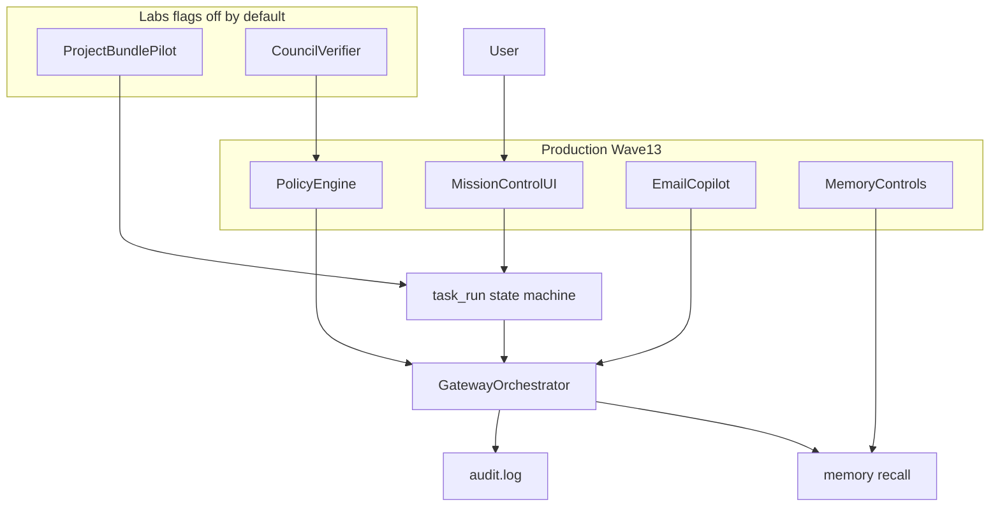
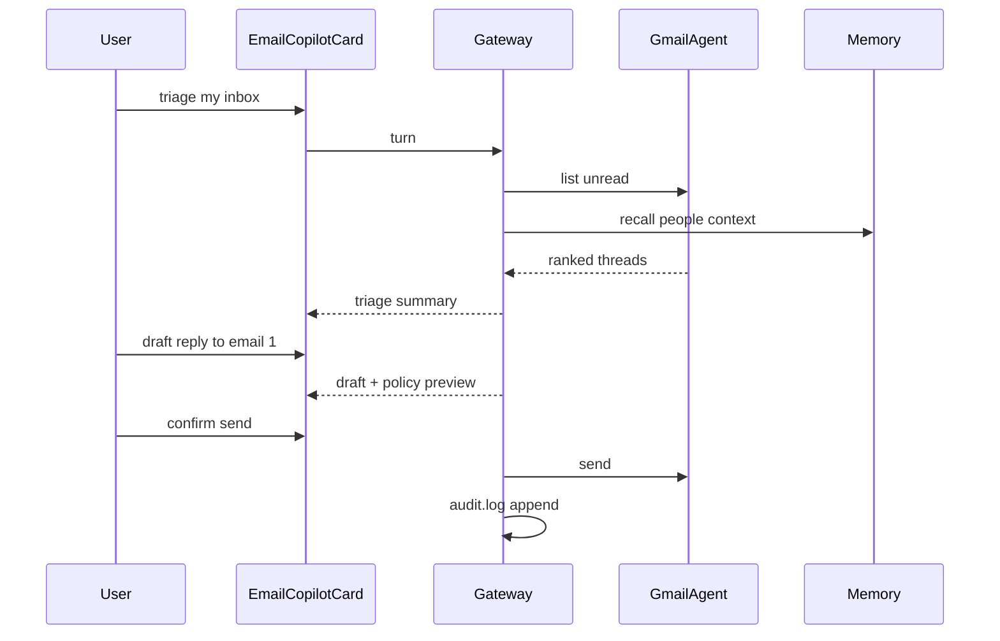

# Wave 13 architecture — Tier Upgrade (hybrid kickoff)

Wave 13 implements the first **hybrid** phase: production tracks (mission control, policy, email copilot, memory controls) plus lab pilots (project bundle, council verifier).

## Production vs labs



## New components (planned)

| Component | Path | Role |
|-----------|------|------|
| Task run state | `gateway/task_run.rs` | Persist multi-step runs |
| Task run DB | migration v2: `task_runs`, `task_run_steps` | Checkpoint/resume |
| Policy class | `gateway/types.rs` → `GatewayPolicyClass` | Classify actions |
| Audit ledger | `gateway/audit.rs` | Append-only external mutations |
| Mission control UI | `ui/cockpit/MissionControlPanel.tsx` | Timeline + approvals |
| Email copilot UI | `ui/workspaces/sections/EmailSections.tsx` | Triage + draft CTAs |
| Labs config | `gateway/config.rs` → `GatewayLabsConfig` | Feature flags |

## Existing leverage (Wave 12)

| Already shipped | Wave 13 extension |
|-----------------|-------------------|
| Meeting copilot + F42 | Meeting follow-up **bundle** (lab) |
| Gateway confirmation | Unified **approval inbox** |
| Gateway trace toggle | Full **explainability** trace |
| `trigger_events` + headless | Email triage **proactive** trigger |
| Memory workspace cards | **Pin/forget/correct** controls |
| Fabric F1–F42 | F43–F48 task + policy evals |

## Email copilot flow



## Implementation order

1. T13-B Policy + audit
2. T13-F Reliability (task_run schema)
3. T13-A Mission control UI
4. T13-D Memory controls
5. T13-C Email copilot
6. T13-E Evals F43–F48
7. Lab L1 bundle + Lab L2 verifier (flags)

See [TIER_UPGRADE_BALANCED_90D.md](./TIER_UPGRADE_BALANCED_90D.md) and [TIER_UPGRADE_MOONSHOT_LABS.md](./TIER_UPGRADE_MOONSHOT_LABS.md).

## Verify gate

```powershell
cd apps/desktop/src-tauri; cargo test --lib -j 1
cd ../..; npx tsc --noEmit
npm run build
```

Fabric index target after Wave 13: **48**.
