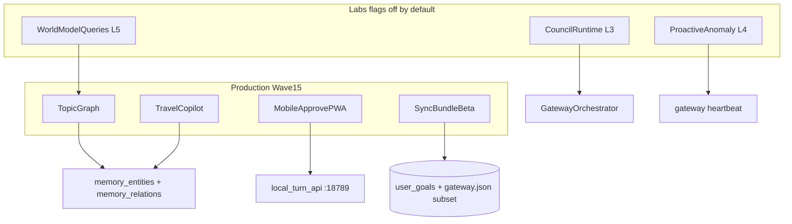
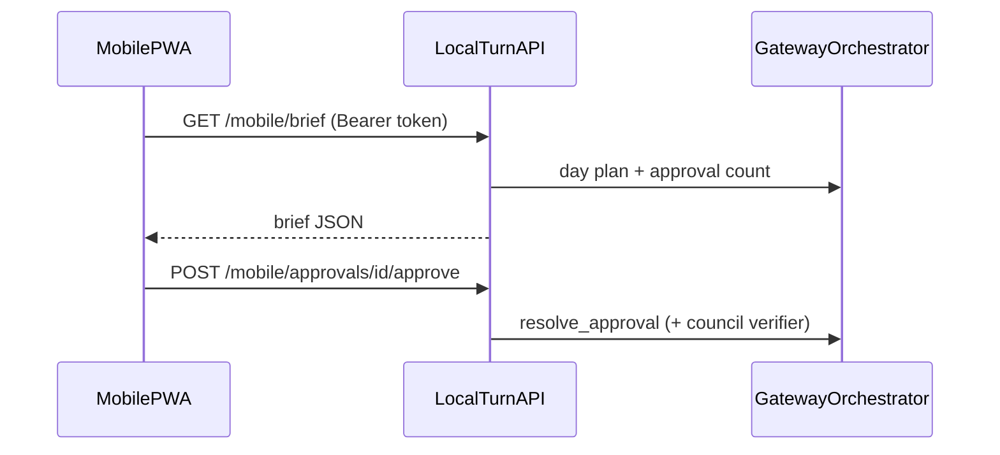

# Wave 15 architecture — Platform prep

Wave 15 extends JARVIS from daily-loop copilots (Wave 14) into **mobile approvals**, a **memory topic graph**, **travel copilot**, **world-model queries** (lab L5), and a **local-first sync beta**.

## Production vs labs



## Wave 14 graduation (closeout)

| Lab / track | Flag | Graduation criteria |
|-------------|------|---------------------|
| L1 project bundle | `labs.projectBundlePilot` | Sequential steps: Gmail → meeting prep → draft → Notion task; audit rollback refs; proactive `meeting_followup_bundle` trigger |
| L2 council verifier | `labs.councilVerifier` | Re-check on approve; F56 bad-send fixtures ≥80% block rate |
| L3 council runtime | `labs.councilRuntime` | Vote log in `app_data/council/{turn_id}.json` for bundles |
| L4 proactive anomaly | `labs.proactiveAnomaly` | Heartbeat heuristics; dismiss/accept telemetry; Command workspace nudge cards |

## New components

| Component | Path | Role |
|-----------|------|------|
| Mobile API | `gateway/local_turn_api.rs` | `GET /mobile/brief`, approvals list + approve/deny |
| Mobile PWA | `apps/desktop/public/approve/` | Installable LAN approve UI |
| Topic graph | `memory/topic_graph.rs` | `memory_relations` edges; infer + query neighbors |
| Travel copilot | `memory/travel_copilot.rs` | Trip prep from travel memory + calendar + Gmail |
| World model | `memory/world_model.rs` | Read-only graph queries behind L5 flag |
| Sync bundle | `gateway/sync.rs` | Encrypted export/import of settings, goals, recipes |
| Wave 15 commands | `commands/wave15.rs` | Graph, goals, sync, nudge Tauri commands |

## Schema migrations

| Version | Tables |
|---------|--------|
| v4 | `memory_relations`, `proactive_nudge_log` |
| v5 | `user_goals` |

## Mobile approve flow



## Eval fabric (F56–F60)

| ID | Capability | Eval |
|----|------------|------|
| F56 | `labs.verifier` | `f_council_verifier_execution.json` |
| F57 | `channels.mobile` | `local_turn_api.rs` unit tests |
| F58 | `memory.graph` | `f_topic_graph_routes.json` |
| F59 | `memory.travel` | `f_travel_copilot_routes.json` |
| F60 | `labs.worldmodel` | `f_world_model_execution.json` |

## Verify gate

```powershell
npm --workspace @jarvis/desktop run build
cd apps/desktop/src-tauri; cargo build --lib --no-default-features
# Full `cargo test` on Linux CI; Windows may hit STATUS_ENTRYPOINT_NOT_FOUND — use --no-default-features locally.
```

## Out of scope (Wave 16+)

- Hosted cloud sync with auth
- Work/personal/lab profiles, Skill SDK, headless API docs
- Lab L6 ambient copilot
