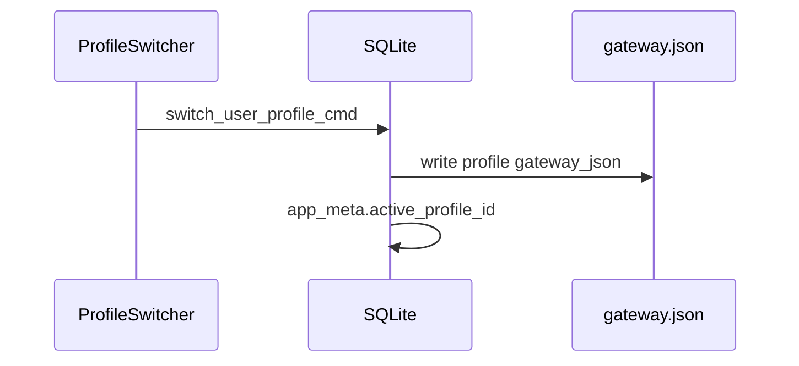

# Wave 16 architecture — Platform

Wave 16 delivers **profiles**, **headless API docs**, **Skill SDK v1**, and **Lab L6 ambient copilot**, gated by the Sprint 0 E2E harness.

## Tracks

| Track | Module | Flag / storage |
|-------|--------|----------------|
| Profiles | `gateway/profiles.rs` | `user_profiles` table v6, `app_meta.active_profile_id` |
| Headless API | `docs/HEADLESS_API.md` | `local_turn_api.rs` port 18789 |
| Skill SDK | `gateway/skills.rs`, `packages/skill-sdk` | `app_data/skills/*/skill.json` |
| L6 Ambient | `gateway/ambient.rs` | `labs.ambientCopilot`, `ambient_sessions` v7 |

## Profile flow

## Skill SDK v1

Manifest-driven keywords merge at runtime via `match_dynamic_skill`. Handlers: `route`, `http`, `script` (Wasm deferred).

## Ambient copilot (L6)

Read-only suggestions during consented focus sessions. OCR/voice signals call `maybe_suggest_from_signal` — never auto-write.

## Eval fabric F61–F64

| ID | Eval |
|----|------|
| F61 | `f_profile_switch_routes.json` |
| F62 | `local_turn_api.rs` turn schema tests |
| F63 | `f_skill_sdk_routes.json` |
| F64 | `f_ambient_copilot_routes.json` + `ambient.rs` unit test |

## Verify gate

See [E2E_RUNBOOK.md](./E2E_RUNBOOK.md) and [ROADMAP.md](./ROADMAP.md).
