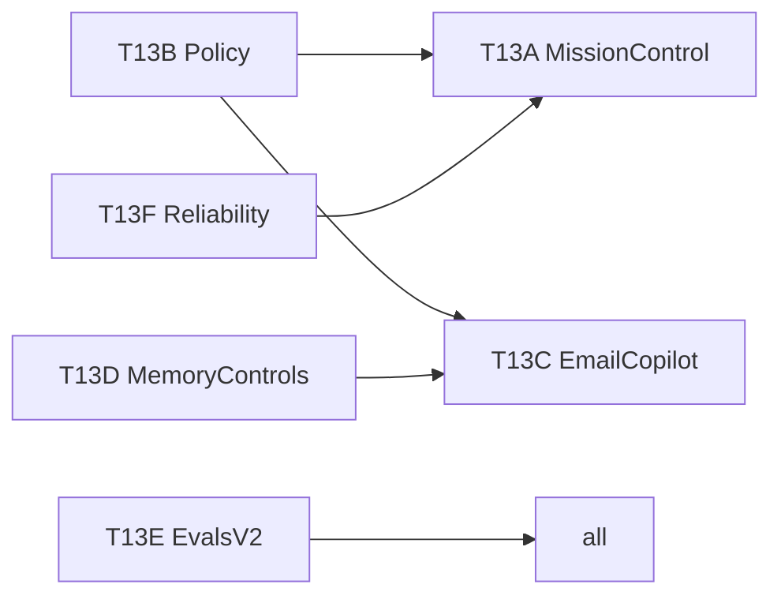

# Tier Upgrade — Balanced 90-day plan (Wave 13)

Production lane for the first hybrid phase. Target: **60–70%** of implementation capacity.

## Wave 13 tracks

### T13-A — Mission control v1

**Goal:** Users see what Jarvis is doing and what needs approval.

| Deliverable | Location / pattern |
|-------------|-------------------|
| Task run state machine | `gateway/task_run.rs` — `queued → running → blocked → awaiting_approval → done/failed` |
| Run persistence | SQLite `task_runs` + `task_run_steps` (migration v2, user approval) |
| Timeline UI | `MissionControlPanel.tsx` in cockpit; binds to gateway bus events |
| Approval inbox | Reuse `pendingGatewayConfirmation`; unify send/calendar/notion queues |
| Explainability | Extend gateway trace: route, memory snippets, policy class |

**Evals:** `f_mission_control_routes.json`, `f_task_run_execution.json` (F43–F44)

---

### T13-B — Trust & policy baseline

**Goal:** Safe autonomy foundation before labs expand scope.

| Deliverable | Detail |
|-------------|--------|
| Policy classes | `read`, `write`, `send`, `delete` — see [SAFETY_POLICY_MATRIX.md](./SAFETY_POLICY_MATRIX.md) |
| Preview-before-send | Email draft diff, calendar event diff, Notion page diff |
| Audit ledger | Append-only `audit.log` in app data; one line per external mutation |
| Simulation guard | Block legacy + gateway writes when `GatewayMode::PlanOnly` |

**Evals:** `f_policy_execution.json` (F45)

---

### T13-C — Email copilot

**Goal:** Daily habit loop — triage, draft, save.

| Command / trigger | Behavior |
|-------------------|----------|
| `triage my inbox` | Top N unread with urgency labels |
| `draft a reply to email 1` | Draft using thread context + memory |
| `save this email to notion` | Existing path; surface in copilot card |
| Proactive | `gmail_label_inbox` trigger → morning triage nudge |

**UI:** Email workspace card (mirror Meeting Copilot in MemorySections pattern)

**Evals:** `f_email_copilot_routes.json`, `f_email_copilot_execution.json` (F46–F47)

---

### T13-D — Memory v2 controls

**Goal:** User trust in what Jarvis remembers.

| Control | API / UI |
|---------|----------|
| Pin | Boost retrieval score; UI pin icon on memory cards |
| Forget | Soft-delete entity; exclude from recall |
| Correct | Edit field + store correction metadata |
| Confidence | `high / medium / low` badge on retrieved snippets |

**Rust:** extend `memory/mod.rs` entity metadata; no schema break — JSON metadata fields.

**Evals:** extend `f_memory_gateway_routes.json`

---

### T13-E — Evals v2 baseline

**Goal:** Measure tasks, not just routes.

| Deliverable | Detail |
|-------------|--------|
| Task success schema | `TaskEvalCase` in `evals.rs` |
| Regression pack | calendar + email + files + memory + shell |
| KPI export | `evals-summary.json` after `cargo test` harness |

See [METRICS_AND_EVALS_V2.md](./METRICS_AND_EVALS_V2.md).

---

### T13-F — Reliability core

**Goal:** Retries and resume for gateway steps.

| Deliverable | Detail |
|-------------|--------|
| Typed failures | `StepFailureKind` enum on `StepResult` |
| Retry budget | Per-turn cap from `GatewayConfig.budgets` |
| Checkpoint | Serialize last successful step id on `task_runs` |
| Resume command | `resume last task` → L0 route |

---

## Wave 13 verify gate

```powershell
cd apps/desktop/src-tauri; cargo test --lib -j 1
cd ../..; npx tsc --noEmit
npm run build
```

Fabric index target: **48** (F43–F48).

## Dependency order



Implement: **T13-B → T13-F → T13-A → T13-D → T13-C → T13-E**.
