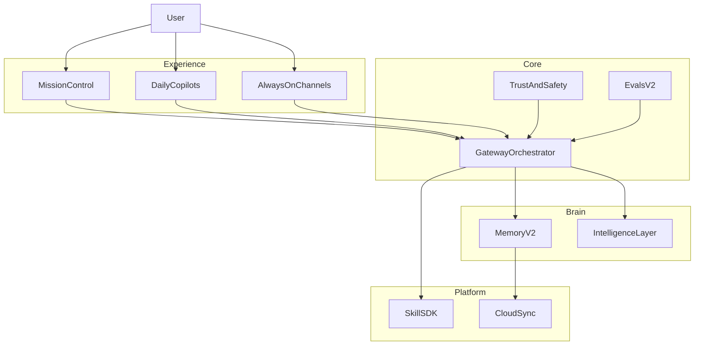

# JARVIS Tier Upgrade — Vision

Post–Wave 12, JARVIS evolves from a capable desktop assistant into a **dependable autonomous operator**: visible progress on goals, safe external actions, smarter memory, daily copilots, and optional frontier labs behind flags.

## Hybrid model

Every initiative runs on two lanes:

| Lane | Purpose | Promotion rule |
|------|---------|----------------|
| **Production (balanced)** | Shippable features with guardrails, evals, rollback | Default user-facing path |
| **Labs (moonshot)** | High-variance experiments behind `gateway.labs.*` flags | Graduates only when Lens A stable and Lens B/C improve |

### Evaluation lenses

- **Lens A — Reliability & trust** (must not regress): failed steps %, rollback usage, user stop rate, safety incidents.
- **Lens B — Autonomy & leverage**: tasks fully auto-completed, human minutes saved, multi-step flows end-to-end.
- **Lens C — Delight & stickiness**: weekly active days, proactive accept vs dismiss, copilot repeat use.

## Eight capability clusters

| Cluster | North star |
|---------|------------|
| **Mission control** | One screen: plan, steps, blockers, approvals, explainability |
| **Daily copilots** | Email, day planner, meeting v2, travel, focus, debrief |
| **Memory v2** | Pin/forget/correct, confidence, commitments, topic graph |
| **Always-on** | Trigger recipes, new channels, playbooks, mobile approve |
| **Work & builder** | Project bundles, code/doc pipelines, skill builder v2 |
| **Trust & safety** | Policy classes, preview, rollback, audit ledger |
| **Intelligence** | Verifier pass, council lab, proactive anomaly, evals v2 |
| **Platform** | Profiles, skill SDK, optional sync, headless API |

## Phased horizon

| Phase | Window | Production focus | Labs focus |
|-------|--------|------------------|------------|
| **Wave 13** | 0–90 days | Mission control v1, policy + approvals, email copilot, memory controls, evals v2 baseline | Project bundle pilot; verifier on send |
| **Wave 14** | 3–6 months | Day planner, trigger recipes, meeting copilot v2, audit ledger | Council on hard tasks; proactive anomaly |
| **Wave 15** | 6–12 months | Mobile approve PWA, rollback, topic graph | World model queries; cloud sync beta |
| **Wave 16+** | 12+ months | Profiles, skill SDK v1 | Marketplace, full project operator |

## Docs map

- [TIER_UPGRADE_BALANCED_90D.md](./TIER_UPGRADE_BALANCED_90D.md) — Wave 13 production tracks
- [TIER_UPGRADE_MOONSHOT_LABS.md](./TIER_UPGRADE_MOONSHOT_LABS.md) — lab flags and graduation criteria
- [SAFETY_POLICY_MATRIX.md](./SAFETY_POLICY_MATRIX.md) — action classes and approval UX
- [METRICS_AND_EVALS_V2.md](./METRICS_AND_EVALS_V2.md) — task-level KPIs and fabric expansion
- [ARCHITECTURE_WAVE13.md](./ARCHITECTURE_WAVE13.md) — Wave 13 technical slice
- [ROADMAP.md](./ROADMAP.md) — wave checklist

## Success metrics (Tier Upgrade)

| Metric | Wave 13 target | Wave 14 target |
|--------|----------------|----------------|
| Failed execution turns | −40% vs Wave 12 baseline | −55% |
| Multi-step task completion | +25% | +50% |
| Proactive false-positive rate | &lt;15% dismiss without action | &lt;10% |
| High-risk actions with preview | 100% send/calendar/delete | + rollback where API allows |
| Fabric task-level evals | F43–F48 | F49–F55 |
